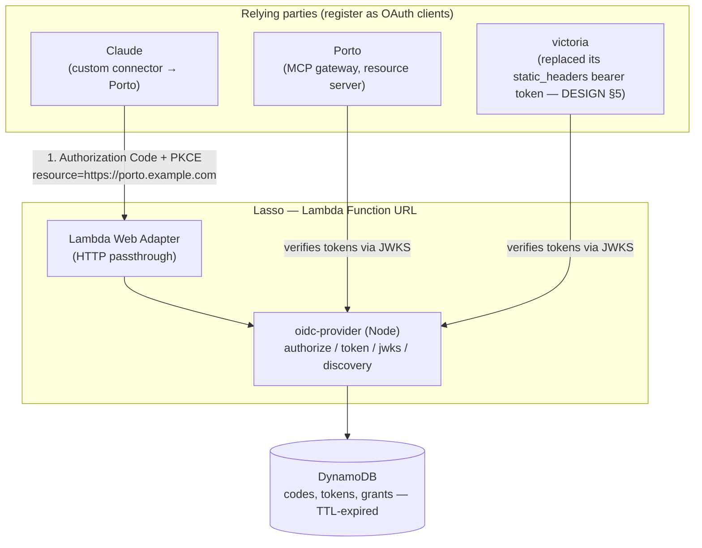

# Lasso — Personal SSO — Design

*Luke's Anytime SSO*

## 1. Goal

A single, self-hosted OAuth 2.1 / OIDC authorization server for all personal
projects — one identity (Luke), one login, correctly audience-scoped tokens
per app. Replaces the pattern of each project bringing its own auth (fife's
own Cognito user pool, sommething's Supabase auth, Porto's inbound-auth
question) with one shared identity provider that every project registers
against as a relying party / protected resource.

This came out of designing **[porto](../../porto/docs/DESIGN.md)** (an MCP
gateway that needs to be an OAuth resource server for Claude's custom
connector flow) and a stated goal of eventually giving **victoria** real
OAuth too, instead of the personal-access-token/IAM shortcuts used for v1.
Rather than solve "Porto's auth" and "victoria's auth" as two more one-off
integrations, Lasso solves it once.

Low cost is a hard constraint, same as porto and victoria: single user, low
request volume, should run for effectively $0/month.

## 2. Why not Cognito or Supabase

- **Supabase free tier** pauses projects after a period of inactivity —
  directly experienced with sommething, and the reason this project exists
  rather than just adding Cognito.
- **Cognito** doesn't have that failure mode (no auto-pause, AWS just bills
  near-zero on the free tier), but has a real interop gap: MCP's
  authorization spec requires clients to send RFC 8707 `resource`
  parameters on both the authorize and token requests, audience-binding the
  token to a specific resource server. Cognito doesn't honor RFC 8707 — it
  only supports its own pre-8707 "Resource Server + custom scopes"
  mechanism. Workarounds exist (see
  [empires-security/mcp-oauth2-aws-cognito](https://github.com/empires-security/mcp-oauth2-aws-cognito)),
  but it's a real spec gap, not a nonissue.
- Both are also, structurally, a *product's* auth system — reusing them
  means every new project either takes on a dependency on that product or
  gets its own separate instance of one. Neither gives one shared identity
  across all personal projects, which is the actual goal here.

## 3. Approach: self-host `oidc-provider`, not a hand-rolled AS

Not building OAuth/OIDC from scratch — that's exactly the kind of code
where a subtle bug (PKCE verification, JWT validation, code replay) is a
security bug, not a UX bug. Instead: **[`oidc-provider`](https://github.com/panva/node-oidc-provider)**
(npm, `panva/node-oidc-provider`, currently v9.x) — a mature,
spec-compliant, actively maintained OIDC provider library for Node.js. It
natively supports RFC 8707 resource indicators
(`features.resourceIndicators`), PKCE, and standard discovery/JWKS
endpoints, so it sidesteps Cognito's gap entirely.

Lasso is a thin deployment of this library: our own configuration (clients,
resources/scopes, signing keys, storage adapter) around `oidc-provider`, not
a reimplementation of it.

## 4. Architecture overview

Flow for the Porto case (the first consumer): Claude starts the OAuth
dance against Porto's declared authorization server (Lasso), requesting a
token scoped to Porto's resource identifier. Lasso authenticates Luke
(single hardcoded/interactive user — no signup, no multi-tenant user
management), issues a token audience-bound to Porto via
`resource=<porto-resource-id>`. Porto verifies that token against Lasso's
JWKS on every request. Porto's own *outbound* legs to sommething/victoria
are unrelated to this (see porto's `docs/DESIGN.md` §5) — Lasso only
covers the inbound Claude→Porto leg for now.

victoria (the second consumer) is the same shape: Claude is again the
OAuth client, this time doing the dance directly against victoria's MCP
server rather than through a gateway. victoria declares Lasso as its
authorization server via `.well-known/oauth-protected-resource` and
verifies Bearer JWTs against Lasso's JWKS with its own resource
identifier as the expected audience — see victoria's `docs/DESIGN.md` §5.

## 5. Deployment shape

Mirrors porto and victoria's existing choices — consistent low-cost,
AWS-native, Lambda-first pattern across all personal infra:

- **Compute**: Lambda Function URL + [AWS Lambda Web Adapter](https://github.com/awslabs/aws-lambda-web-adapter),
  same shape as porto. `oidc-provider` is a normal Express-style Node HTTP
  app; the adapter lets it run unmodified as a Lambda handler.
- **Storage**: DynamoDB, single table, storing authorization codes, access/
  refresh tokens, and grants. Use DynamoDB's native TTL attribute for
  expiry — no cleanup job needed. The unmaintained community
  `oidc-provider-dynamodb-adapter` package (last published years ago, not
  worth depending on) is skipped in favor of a small custom adapter — the
  `oidc-provider` `Adapter` interface is documented and intentionally small
  (`upsert` / `find` / `findByUserCode` / `findByUid` / `consume` /
  `destroy` / `revokeByGrantId`), so this is normal practice, not a
  shortcut.
- **Signing keys**: JWKS keypair generated once, stored in Secrets Manager,
  loaded at cold start.
- **Region**: `us-east-1`, matching victoria and porto.
- **No API Gateway**, same reasoning as porto/victoria — Function URL is
  free, API Gateway isn't.

## 6. Single-user model

No signup flow, no password reset, no admin UI — Lasso has exactly one
user. The "login" step in the Authorization Code flow can be as simple as a
hardcoded credential check (env var / Secrets Manager) or a passkey,
decided during implementation — either way it's dramatically simpler than a
general-purpose IdP because there's no multi-tenancy to build.

## 7. Clients and resources

Each consuming project registers as an `oidc-provider` **client** (the
thing requesting tokens — for the Porto case, this is actually Claude
itself, since Claude is the OAuth client in the MCP flow) and each protected
app registers as a **resource** (the thing tokens get audience-bound to,
via `resource=...`). Concretely for the Porto case:

- **Resource**: `https://porto.<domain>` (or whatever Porto's resource
  identifier ends up being) — Porto verifies tokens with this audience.
- **Client**: registered for Claude's fixed redirect URI,
  `https://claude.ai/api/mcp/auth_callback`.

victoria adds its own resource identifier (its Lambda Function URL) the
same way, reusing the same `claude-mcp` client — no changes to Porto's
registration needed. This is the payoff of doing it once here instead of
per-project.

## 8. Open questions

- **Single-user login mechanic** — hardcoded credential vs. passkey vs.
  something else. Deferred to implementation; low-stakes either way given
  there's exactly one user.
- **Custom DynamoDB adapter** — needs writing against `oidc-provider`'s
  `Adapter` interface; no off-the-shelf maintained option exists (see §5).
- **Does Claude's MCP client actually enforce RFC 8707 strictly**, or
  degrade gracefully without it? Matters less here than it would for
  Cognito, since `oidc-provider` supports it natively either way — but
  worth confirming behavior empirically once Porto is wired up against
  Lasso.
- **Domain/DNS** — Lambda Function URLs get an ugly default hostname;
  OAuth discovery documents and issuer identifiers read better on a real
  domain. Needs a decision on whether Lasso (and porto) sit behind a
  custom domain, and if so, shared or per-project.
- **Migrating fife off its own Cognito pool** — not in scope now, but
  listed in §1 as a plausible future consumer; no action needed until
  actually prioritized.
